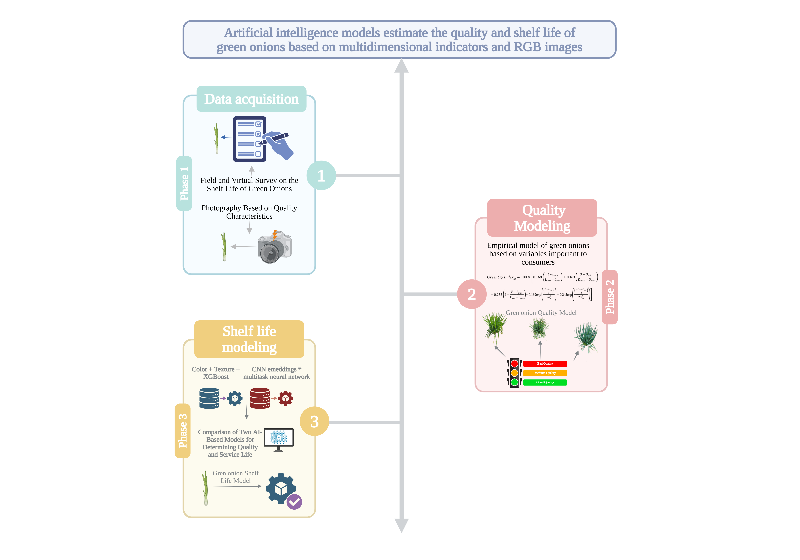

# Artificial intelligence models for quality and shelf-life estimation in green onion

Analysis notebooks for estimating the quality and shelf life of green onion (*Allium fistulosum* and hybrid) genotypes, combining consumer perception surveys with physicochemical measurements.



## Summary

Artificial intelligence models estimate the quality and shelf life of green onions from multidimensional indicators and RGB images. The work is organized in three phases:

1. **Data acquisition.** A field and virtual survey collects consumer perception of green onion shelf life, and the samples are photographed according to their quality characteristics.
2. **Quality modeling.** An empirical model, the GreenOQ Index, scores green onions on the variables that matter most to consumers. It combines pseudostem length (*L*), diameter (*D*) and firmness (*F*) as min–max utilities with hue (*h*) and pyruvic acid (*AP*) as Gaussian penalties:

   $$\text{GreenOQ Index}_{gt} = 100 \times \left[0.168\,\frac{L-L_{min}}{L_{max}-L_{min}} + 0.163\,\frac{D-D_{min}}{D_{max}-D_{min}} + 0.255\left(1-\frac{F-F_{min}}{F_{max}-F_{min}}\right) + 0.169\,e^{-\frac{(h-h_{obj})^2}{2\sigma_h^2}} + 0.245\,e^{-\frac{(AP-AP_{obj})^2}{2\sigma_{AP}^2}}\right]$$

   The resulting green onion quality model sorts samples into bad, medium and good quality.
3. **Shelf-life modeling.** Two AI approaches trained on the photographs are compared for determining quality and shelf life: color and texture descriptors with gradient boosting (**CTD-GB**), and CNN embeddings with a multitask neural network (**CNN-MTL**). The result is the green onion shelf-life model.

## Repository structure

```
├── docs/
│   └── graphical_abstract.png             # graphical abstract (figure above)
├── data/
│   └── Phase_1_Consumer_perception.xlsx   # consumer survey responses
├── notebooks/
│   ├── Phase_1_Consumer_perception.ipynb  # consumer perception and acceptance analysis
│   ├── Phase_2_GreenOQ.ipynb              # GreenOQ quality index (GQI)
│   └── Phase_3_AI_models.ipynb            # AI models from one photograph (CTD-GB and CNN-MTL)
├── results/
│   ├── README.md                          # the headline result, the metrics and the energy summary
│   ├── figures/                           # the main result figure
│   ├── Phase3_complete_metrics.xlsx       # every Phase 3 metric in one workbook (20 sheets)
│   ├── GreenOQ_results.csv                # GQI per genotype × shelf-life time
│   └── GQI_classification.csv             # mean GQI and quality class per genotype
├── scripts/
│   └── build_phase3_complete_metrics.py   # merges the three Phase 3 workbooks into one
└── requirements.txt
```

The large Phase 3 inputs (photographs, feature caches, stored validation) are not in the repository; see the Phase 3 section below.

**[→ Read the results](results/README.md)** — the headline result, the metrics of both models under the three validation protocols, and the energy cost of training and inference.

## Phase 1 — Consumer perception

`notebooks/Phase_1_Consumer_perception.ipynb` analyzes the consumer survey for ten genotypes:

- **a)** Likert (1–5) ratings of visual attributes (pseudostem color, length and diameter; leaf color and length).
- **b)** Purchase intention by genotype (No / Maybe / Yes).
- **c)** Acceptance curve across shelf life derived from the *"when would you stop purchasing"* question.
- **d)** Acceptance curve from direct selection of genotypes at each timepoint (T1–T4).
- **e)** Acceptance heatmap for the balanced panel (respondents who answered T1–T4).

Input: `data/Phase_1_Consumer_perception.xlsx` (sheets `Preguntas por material` and `Preguntas en vida util`).

## Phase 2 — GreenOQ Index (GQI)

`notebooks/Phase_2_GreenOQ.ipynb` builds a 0–100 quality index from five variables:

| Variable | Symbol | Weight source | Utility |
|---|---|---|---|
| Pseudostem length | L | Consumer surveys A + B | increasing min–max |
| Pseudostem diameter | D | Consumer surveys A + B | increasing min–max |
| Pseudostem hue | h | Consumer surveys A + B | Gaussian around fresh (T1) hue |
| Firmness | F | PCA communality | decreasing min–max |
| Pyruvic acid | AP | PCA communality | Gaussian around panel median |

The visible and lab blocks are combined with equal mass (50/50). Genotypes are classified as Low / Medium / High quality by terciles of their mean GQI. The notebook also compares earlier weighting schemes (survey only, 60/40) as a sensitivity check.

Inputs (place them in `data/`; they are not included in the repository):

- `ANALISIS FISICOQUIMICO COMPLETO.xlsx` — sheet `Sheet1`, physicochemical analysis per genotype and time.
- `AcPiruvicoVidaUtil.xlsx` — sheet `AcPiruvico`, pyruvic acid at T1 and T4.

## Phase 3 — AI models from one photograph

`notebooks/Phase_3_AI_models.ipynb` estimates the remaining shelf life, the quality state and the GQI of Phase 2 from a single RGB photograph of the pseudostem. It is self-contained: all the code lives in the notebook.

Two models are compared, both trained on 16,396 photographs:

- **CTD-GB** — 109 color, texture and shape descriptors measured on the segmented pseudostem, with histogram gradient boosting (simple and interpretable).
- **CNN-MTL** — those descriptors plus 512 ResNet18 embeddings, with a multitask neural network that predicts shelf life, quality state and GQI at once, using the 61 laboratory traits as auxiliary targets.

Validation is bulb-grouped so no bulb appears in both training and test: 5-fold cross-validation (P1), unseen storage time (P2) and unseen genotype (P3), plus repeated validation and a permutation test for leakage control.

### Data

Place these files in `data/`, or point the environment variable `GREEN_ONION_DATA` at the folder that holds them. They are not in the repository because of their size:

| File | What it is |
|---|---|
| `dataset_final.csv` | 16,396 photographs with genotype, storage time, quality state, shelf life and 61 laboratory traits |
| `cache_descriptores_mejorados.npz` | the 109 descriptors already measured on every photograph |
| `cache_embeddings_cnn.npz` | the 512 ResNet18 embeddings of every photograph |
| `GQI_vs_modelo_completo_datos.xlsx` | GQI of Phase 2, per genotype × storage time |
| `cache/predictions.pkl`, `cache/extra_validation.pkl`, `cache/cnn_mtl_demo.pt` | stored validation output and the demo model, to skip the long runs |

`Phase_1_Consumer_perception.xlsx` is already in `data/`. The photographs themselves are not needed to reproduce any number — the two caches hold everything the models read. They are only required to rebuild those caches or to display photographs; if you have them, set `GREEN_ONION_PHOTOS` to the folder containing `GreenOnionCap3`.

### Running it

The three flags at the top of the notebook control how much is recomputed. With all of them `False` (the default) the notebook loads the stored results and runs in about 20 minutes:

| Flag | `True` recomputes | Time |
|---|---|---|
| `RUN_FEATURE_EXTRACTION` | the two image-feature caches (needs the photographs) | several hours |
| `RUN_FULL_VALIDATION` | P1, P2, P3 and the grouped split | ~50 min |
| `RUN_EXTRA_VALIDATION` | repeated validation and the permutation test | ~30 min |

Outputs go to `results/`: figures at 300 dpi in `results/Phase_3_figures/` (PNG and PDF), and the workbooks `Phase3_hyperparameters_and_validation.xlsx`, `Phase3_results_by_model.xlsx` and `Phase3_results_dataset.csv`/`.xlsx`.

## How to run

```bash
pip install -r requirements.txt
jupyter lab   # or open the notebooks in VS Code
```

The notebooks can be run from the repository root or from `notebooks/`; paths are resolved relative to the repository. Figures use Times New Roman, which must be installed on the system.

Source spreadsheets keep their original Spanish sheet names, column names and answer labels (e.g. `Genotipo`, `Tiempo`, `Tal vez`, `Sí`); the notebooks refer to them as-is.
