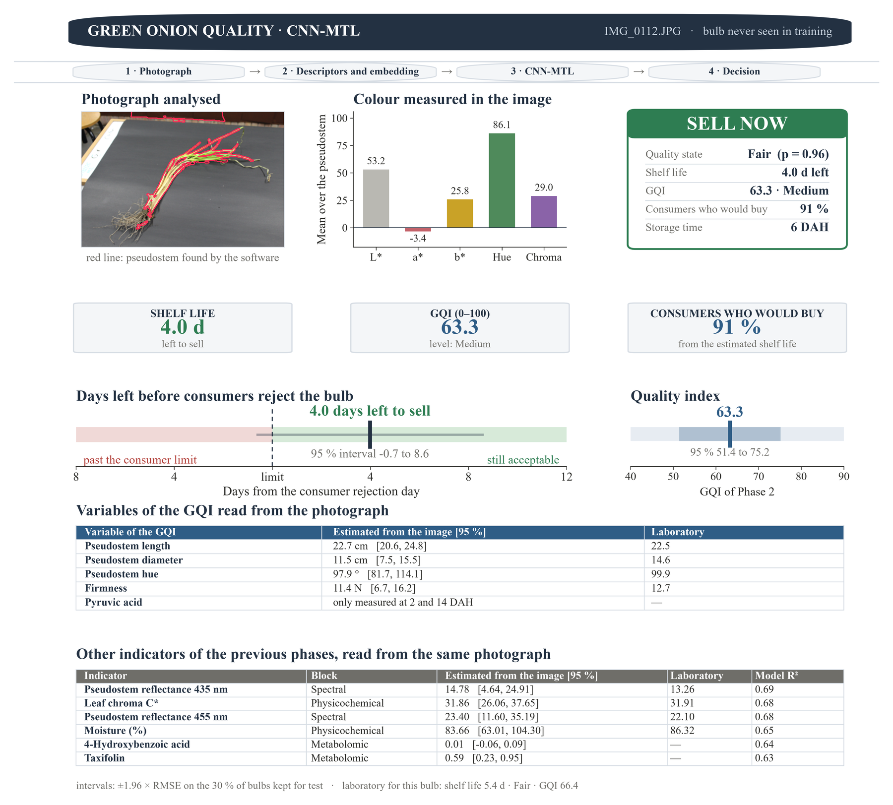

<div align="center">

# Results

### Artificial intelligence models for quality and shelf-life estimation in green onion


</div>

---

## The headline result

**One photograph in. A selling decision out.**

<div align="center">



<sub><b>Figure 1.</b> CNN-MTL report card for <code>IMG_0112.JPG</code>, a bulb held out of training.<br>
Laboratory reference for this bulb: shelf life <b>5.4 d</b> · quality state <b>Fair</b> · GQI <b>66.4</b>.<br>
Estimated from the photograph alone: <b>4.0 d</b> · <b>Fair</b> (p = 0.96) · GQI <b>63.3</b>.</sub>

</div>

### How to read it


| Panel | What it shows |
|---|---|
| **Photograph analysed** | The pseudostem the software found on its own — the red outline is the segmentation. Nothing is delimited by hand. |
| **Colour measured in the image** | L\*, a\*, b\*, hue and chroma averaged over the segmented pseudostem. These feed the model; they are not read off a colorimeter. |
| **Decision card** | Quality state with its probability, days of shelf life left, GQI with its level, the share of consumers who would still buy, and the storage time. |
| **Days left before consumers reject the bulb** | The estimate against the consumer rejection day of Phase 1. Left of the limit the bulb is past it; right of it, still sellable. The band is the 95 % interval. |
| **Quality index** | The Phase 2 GQI recovered from the photograph, with its 95 % interval, on the 40–90 scale the panel occupies. |
| **Variables of the GQI** | Every input of the Phase 2 index estimated from the image, side by side with the laboratory value for the same bulb. |
| **Other indicators** | Spectral, physicochemical and metabolomic traits of the earlier phases, also recovered from the same photograph, each with the R² of its auxiliary head. |

> [!NOTE]
> Intervals are ±1.96 × RMSE on the 30 % of bulbs kept for test. The bulb in Figure 1 never appeared in training — validation is **bulb-grouped**, so no photograph of a bulb can be in the training set and the test set at the same time.

---

## What the models estimate

Three outputs from the same photograph. Per bulb, bulb-grouped 5-fold cross-validation, 95 % bootstrap CI (2,000 resamples).

### Shelf life (days)

| Model | MAE | RMSE | R² | CCC | RPD |
|---|---|---|---|---|---|
| CTD-GB | 1.81 [1.72, 1.90] | 2.39 [2.27, 2.51] | 0.743 [0.714, 0.770] | 0.841 [0.822, 0.859] | 1.97 |
| **CNN-MTL** | **1.64 [1.56, 1.71]** | **2.12 [2.02, 2.22]** | **0.798 [0.775, 0.817]** | **0.874 [0.859, 0.887]** | **2.22** |

### Quality state (4 classes)

| Model | Accuracy | Balanced acc. | Macro-F1 | QWK | ±1-grade acc. |
|---|---|---|---|---|---|
| CTD-GB | 0.696 [0.671, 0.722] | 0.695 | 0.695 | 0.709 [0.671, 0.748] | 0.904 |
| **CNN-MTL** | **0.714 [0.689, 0.740]** | **0.713** | **0.713** | **0.763 [0.729, 0.794]** | **0.918** |

### Green Onion Quality Index (0–100)

| Model | MAE | RMSE | R² | CCC | RPD |
|---|---|---|---|---|---|
| CTD-GB | 3.90 [3.71, 4.10] | 5.20 [4.92, 5.48] | 0.739 [0.707, 0.767] | 0.842 | 1.96 |
| **CNN-MTL** | **3.88 [3.70, 4.07]** | **5.13 [4.87, 5.40]** | **0.746 [0.718, 0.773]** | 0.840 | 1.98 |

> On a 0–100 index, a mean absolute error of **3.9 points** means the photograph places a bulb within about four points of its laboratory GQI.

---

## Does it hold outside the training set?

Three protocols, increasingly hard, plus two controls.

| Scheme | What is held out | Model | MAE (d) | R² | Accuracy | QWK |
|---|---|---|---|---|---|---|
| **Grouped 5-fold CV** | the bulb | CTD-GB | 1.81 | 0.743 | 0.696 | 0.709 |
| | | **CNN-MTL** | **1.63** | **0.798** | **0.714** | **0.762** |
| **Repeated grouped CV** | the bulb, 3 × 5 folds | CTD-GB | 1.84 ± 0.09 | 0.733 ± 0.022 | 0.690 ± 0.023 | 0.700 ± 0.037 |
| | | **CNN-MTL** | **1.65 ± 0.09** | **0.794 ± 0.024** | **0.707 ± 0.030** | **0.748 ± 0.039** |
| **Unseen storage time** | a whole timepoint | CTD-GB | 4.19 | −0.101 | 0.471 | 0.406 |
| | | CNN-MTL | 4.10 | −0.048 | 0.448 | 0.410 |
| **Unseen genotype** | a whole genotype | CTD-GB | 2.58 | 0.519 | 0.447 | 0.408 |
| | | CNN-MTL | 2.64 | 0.506 | 0.434 | 0.450 |
| *Trivial baseline* | — | mean + majority class | 4.38 | −0.142 | 0.248 | −0.017 |
| *Permuted labels* | leakage check | CNN-MTL | 4.25 | −0.271 | 0.247 | −0.035 |

**What this says.** Within the population the models saw, a photograph carries real signal — CNN-MTL reaches R² = 0.80 and ±1.6 days. Extrapolating to a **storage time never observed** collapses to baseline: the models interpolate along the senescence trajectory, they do not extrapolate past its end. A **new genotype** costs accuracy but keeps useful regression (R² ≈ 0.51, MAE 2.6 d). The permutation control lands at chance (0.247 against the 0.25 expected), so the grouped split leaks nothing.

---

## ⚡ Energy summary

All of Phase 3 runs on a **laptop CPU with no GPU** — an AMD Ryzen 5 3500U.

### Training · grouped 5-fold cross-validation

| Model | Time per fold | Energy per fold | 5 folds | Energy, 5 folds |
|---|---|---|---|---|
| CTD-GB | 34.8 s | 0.145 Wh | 2.9 min | `██████████████` **0.724 Wh** |
| CNN-MTL | 42.4 s | 0.177 Wh | 3.5 min | `█████████████████` **0.883 Wh** |
| **Both models** | — | — | **6.4 min** | **1.61 Wh** |

<div align="center">

### Training both models, five folds each, costs **1.61 Wh**

A 10 W LED bulb left on for **9.6 minutes**, or **13 %** of one phone charge.

</div>

### Inference · the cost of one decision

| Model | Time per image | Energy per image | Photographs per Wh |
|---|---|---|---|
| CTD-GB | 0.172 ms | 2.576 mJ | ≈ 1.4 million |
| **CNN-MTL** | **0.0079 ms** | **0.118 mJ** | **≈ 30 million** |

CNN-MTL is at once the more accurate model and the cheaper one to run: **22 × less energy per photograph** than CTD-GB. The gradient-boosted ensemble has to walk 2,000 trees, while the network is a single forward pass through 118,307 parameters.

| Scale | CNN-MTL | CTD-GB |
|---|---|---|
| The whole dataset (16,396 photographs) | 1.9 J — **0.0005 Wh** | 42 J — 0.012 Wh |
| One million photographs | 118 J — **0.033 Wh** | 2,576 J — 0.716 Wh |

<div align="center">

### Grading a million green onions costs **0.033 Wh**

Less than a phone spends in one second of screen time.

</div>

### Where the energy is *not* spent

| Stage | Cost | Note |
|---|---|---|
| Training | 1.61 Wh, once | both models, all five folds |
| Inference | 0.118 mJ per photograph | the recurring cost, and it is negligible |
| Feature extraction | **not included above** | the 109 descriptors and the 512 embeddings are computed once per photograph and cached; this is the dominant cost of a first pass over new images |
| Laboratory reference | not measured here | the alternative the model replaces: firmness, pyruvic acid, moisture, spectral and metabolomic assays, per bulb |

> [!IMPORTANT]
> **How the energy was obtained.** Energy = measured wall-clock time × the **15 W nominal TDP** of the AMD Ryzen 5 3500U. It is an **estimate, not a metered measurement**, and it counts the CPU package only — not the display, the drives or the rest of the machine. Read it as an upper-bound-style figure for the compute itself, and above all as a *relative* comparison between the two models, which is where it is meaningful. Inference figures exclude feature extraction. Per-fold times are in sheet `14 Energy and cost` of `Phase3_complete_metrics.xlsx`.

<sub>For reference only, outside the scope of the study: at the Colombian grid factor of ≈ 0.164 kg CO₂ / kWh, training both models corresponds to roughly <b>0.26 g of CO₂</b>.</sub>

---

## Files in this folder

| File | What it holds |
|---|---|
| [`figures/main_result_CNN_MTL_report_card.png`](figures/main_result_CNN_MTL_report_card.png) | Figure 1 — the report card above, for a bulb held out of training |
| [`Phase3_complete_metrics.xlsx`](Phase3_complete_metrics.xlsx) | **every metric of Phase 3 in one workbook** — 20 sheets with an index |
| [`GreenOQ_results.csv`](GreenOQ_results.csv) | Phase 2 — GQI and its five variables, per genotype × storage time |
| [`GQI_classification.csv`](GQI_classification.csv) | Phase 2 — mean GQI, quality class and species, per genotype |

### Inside `Phase3_complete_metrics.xlsx`

| Section | Sheets |
|---|---|
| Models and validation design | `01 Hyperparameters` · `02 Validation design` · `03 Partition sizes` |
| Headline results | `04 Validation summary` · `05 Metrics by output` · `06 Table S7` |
| Detailed metrics | `07 Train-Val-Test` · `08 Runs P1-P2-P3` · `09 CTD-GB` · `10 CNN-MTL` · `11 CNN-MTL no aux` · `12 Trivial baseline` |
| Robustness | `13 Repeated CV` |
| **Energy and computational cost** | **`14 Energy and cost`** |
| Everything in one table | `15 All metrics (long)` |
| Supporting data | `16 Figure data` · `17–19 Predictions P1 / P2 / P3` |

> [!TIP]
> `results/Phase_3_figures/` holds the 300 dpi PNG and PDF figures written by the notebook. It is not tracked in the repository — run [`notebooks/Phase_3_AI_models.ipynb`](../notebooks/Phase_3_AI_models.ipynb) to regenerate it.

---

## Reproducing these numbers

```bash
pip install -r ../requirements.txt
jupyter lab ../notebooks/Phase_3_AI_models.ipynb   # ~20 min with the stored results

# rebuild the merged workbook from the three notebook outputs
python ../scripts/build_phase3_complete_metrics.py
```

The three flags at the top of the notebook control how much is recomputed. `RUN_FULL_VALIDATION = True` re-runs P1, P2 and P3 in about 50 minutes and regenerates the timings behind the energy table. See the [main README](../README.md) for the input files.

<div align="center">
<sub>Universidad Nacional de Colombia · <i>Allium fistulosum</i> and hybrid genotypes · CPU only, no GPU</sub>
</div>
